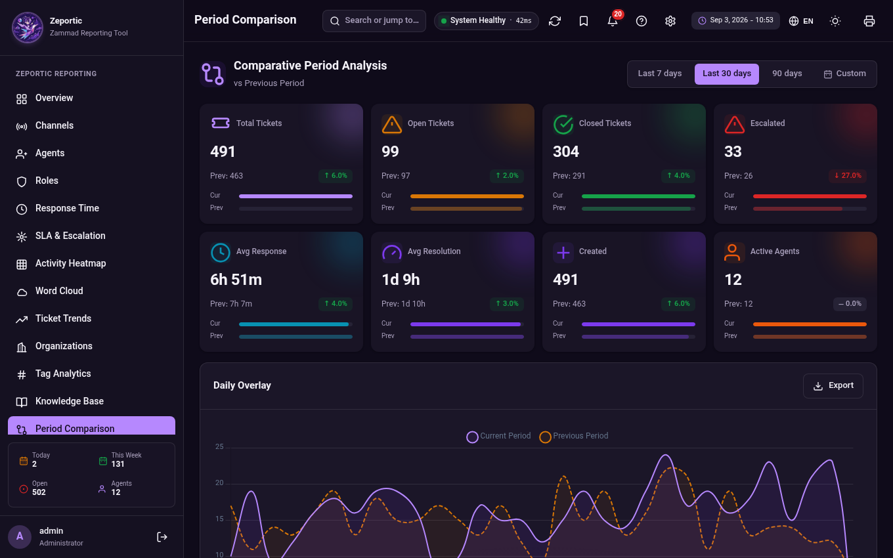
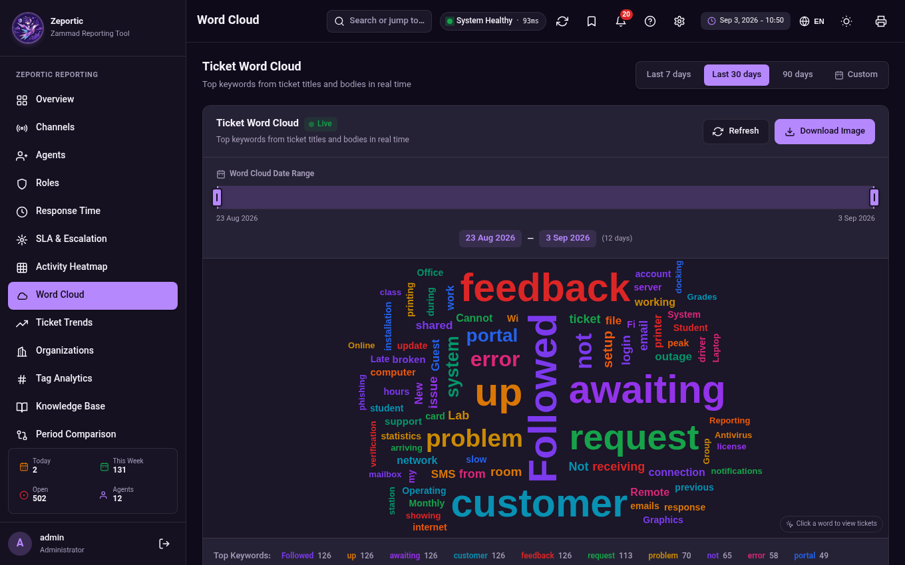

# Zeportic — Zammad Reporting Tool

<p align="center">
  
</p>

<p align="center">
  <strong>Real-time reporting & analytics for your Zammad helpdesk.</strong><br>
  Connects directly to the Elasticsearch indices behind <a href="https://zammad.org">Zammad</a> and turns raw ticket data into clear, decision-ready dashboards.
</p>

<p align="center">
  <a href="https://github.com/TadavomnisT/Zeportic/stargazers"></a>
  
  
  
  
  
</p>

> **Pure PHP. No npm. No bun. No Composer. No CDN. No internet required.**
> Just PHP + HTML + CSS + JS. Clone the repository, run one command, follow the
> setup wizard — done.

---

## Table of contents

1. [Why Zeportic](#why-zeportic)
2. [Features](#features)
3. [Screenshots](#screenshots)
4. [Requirements](#requirements)
5. [Quick start](#quick-start)
6. [First-run setup wizard](#first-run-setup-wizard)
7. [Manual configuration (alternative)](#manual-configuration-alternative)
8. [Configuration reference](#configuration-reference)
9. [Connecting to Zammad](#connecting-to-zammad)
   - [Native (package-based) installation](#native-package-based-installation)
   - [Zammad running on Docker](#zammad-running-on-docker)
   - [Docker Compose service example](#docker-compose-service-example)
   - [Running Zeportic itself as a container](#running-zeportic-itself-as-a-container)
10. [Running as a systemd service](#running-as-a-systemd-service)
11. [Languages & translation](#languages--translation)
12. [Security notes](#security-notes)
13. [API reference](#api-reference)
14. [Troubleshooting](#troubleshooting)
15. [Project structure](#project-structure)
16. [Contributing](#contributing)
17. [License](#license)

---

## Why Zeportic

Zammad is an excellent helpdesk — but its built-in reporting is limited, and the
data lives inside Elasticsearch indices that are awkward to query by hand.

**Zeportic** bridges that gap. It is a small, dependency-free PHP application
that reads Zammad's Elasticsearch indices (`zammad_production_*`) and renders a
complete, admin-only analytics dashboard:

- Zero dependencies to install, zero build steps, zero external requests
- Runs on any machine that can reach your Elasticsearch (same host, LAN, or container)
- Read-only: it never writes a single byte to your Zammad data
- Compatible with **Zammad 6.x and 7.x** (index schema: ticket, user, organization,
  group, role, ticket_state, ticket_priority)

## Features

| Feature | Description |
|---|---|
| **Real-time KPIs** | Total / open / closed tickets, escalations, average first-response and resolution time, active agents — with period-over-period deltas. |
| **14 report sections** | Overview, Channels, Agents, Roles, Response Time, SLA & Escalation, Activity Heatmap, Word Cloud, Ticket Trends, Organizations, Tag Analytics, Knowledge Base, Period Comparison, Tickets. |
| **Interactive word cloud** | The most frequent customer words in real time — click any word to drill into matching tickets. |
| **SLA & escalation analytics** | Compliance per priority, breach counts, escalation rates, response-time percentiles per channel. |
| **Trends & forecasting** | Created-vs-closed daily trend, 7-day linear-regression forecast, anomaly detection (±2σ), period comparison. |
| **AI insights & leaderboard** | Auto-generated textual insights, agent performance leaderboard with podium. |
| **Smart notifications** | SLA breaches, escalations, unassigned and urgent-open ticket alerts. |
| **Exports** | CSV / Excel / PDF export for every table; print-friendly layout. |
| **26 UI languages** | Full RTL & LTR support (English, Persian, Arabic, Hebrew, Urdu, Chinese, Japanese, Korean, Hindi and more) — switchable at runtime. |
| **Dark mode** | A carefully tuned purple dark theme across the whole dashboard (default), with a light theme one click away. |
| **Setup wizard** | A graphical first-run configuration: environment check, connection test with index auto-discovery, admin account creation — no file editing required. |
| **Power-user tools** | Command palette (Ctrl+K), keyboard shortcuts, saved views, settings. |
| **Diagnostics** | `php diagnose.php` runs 9 connection checks with human-readable fixes; every error is structured-logged. |

## Screenshots

<p align="center">
  
</p>

<p align="center">
  
</p>

## Requirements

On the machine that will run Zeportic (usually the Zammad/ES host itself):

- **PHP ≥ 8.0** with the `curl`, `json` and `mbstring` extensions
  (`curl` and `json` are enabled by default on Debian/Ubuntu):
  ```bash
  php -v              # check version
  php -m | grep curl  # check curl extension
  php -m | grep mbstring
  ```
- Network access from this app to your Elasticsearch instance
  (default `http://localhost:9200` or `https://localhost:9200`).
- Your **Elasticsearch password** (the `elastic` user, or a dedicated read-only user).

That's it. **No Composer, no npm, no bun, no build step.**

- Example of easy setup on Debian/Ubuntu : `sudo apt update && sudo apt install -y php-cli php-curl php-mbstring`

## Quick start

### 1. Clone the repository

```bash
git clone https://github.com/TadavomnisT/Zeportic.git
cd Zeportic
```

(Or download and extract the [latest release ZIP](https://github.com/TadavomnisT/Zeportic/releases)
— the contents are identical.)

Deploy it anywhere you like, e.g.:

```bash
sudo cp -r Zeportic /opt/zeportic      # typical server location
cd /opt/zeportic
```

### 2. Start the server

```bash
php -S 0.0.0.0:1234
```

> **That's the whole command.** No `-t`, no router file, no flags — PHP's
> built-in server uses the current folder as docroot and `index.php` as the
> default entry. (Optionally, `./start.sh 8080` does the same with a banner.)

### 3. Open the browser — the setup wizard takes over

Point your browser at `http://YOUR-SERVER-IP:1234`. On the first run the
**graphical setup wizard** starts automatically:

1. **Welcome** — verifies PHP version, extensions and folder permissions.
2. **Elasticsearch** — enter the URL + credentials, hit *Test connection*:
   Zeportic pings the cluster, reports health/version and **auto-discovers
   every `zammad*` index** (with document counts) so you can pick the right
   index prefix from a list instead of guessing.
3. **Admin account** — choose the dashboard login (stored as a modern
   `password_hash`, never plain text), plus default language (26 available)
   and theme (dark by default).
4. **Finish** — settings are saved to `config.local.php` (git-ignored) and you
   are dropped onto the login page.

Log in, and the full dashboard appears. The wizard never appears again until
you delete `config.local.php`.

Verify everything with the built-in doctor at any time:

```bash
php diagnose.php
```

Prefer to configure by hand? See [Manual configuration](#manual-configuration-alternative).

## First-run setup wizard

The wizard (`setup.php`) is only reachable while the instance is **unconfigured**:

- Unconfigured = no `config.local.php` exists AND `config.php` still contains
  the shipped `CHANGE_ME…` placeholders.
- As soon as configuration exists (wizard output **or** a manually edited
  `config.php`), `setup.php` immediately redirects to the dashboard.
- To **re-run** the wizard: `rm config.local.php` and reload the page.
- Security: anyone who can reach an unconfigured instance can claim it by
  completing the wizard — finish setup promptly after deploying.

The wizard writes **only** `config.local.php`; your versioned `config.php`
stays untouched, so `git pull` upgrades are always conflict-free.

## Manual configuration (alternative)

If you'd rather not use the wizard, edit `config.php` — the only file you need
to touch — and replace the placeholders:

```php
'elasticsearch' => [
    'host'          => 'https://localhost:9200',  // your ES endpoint
    'index_prefix'  => 'zammad_production',       // Zammad's default
    'username'      => 'elastic',
    'password'      => 'YOUR_ELASTIC_PASSWORD',   // ← put your elastic password here
    'verify_ssl'    => false,                     // false = accept self-signed cert
    'ca_bundle'     => null,
],
'auth' => [
    'username' => 'admin',
    'password' => 'CHANGE-ME',                    // ← login for the dashboard itself
    // Better: store a hash instead of plain text:
    // 'password_hash' => '$2y$10$...',            // php -r "echo password_hash('CHANGE-ME', PASSWORD_DEFAULT);"
],
```

As soon as the ES password is no longer `CHANGE_ME_ELASTIC_PASSWORD`, the app
considers itself configured and the setup wizard stays out of the way.

## Configuration reference

Effective configuration = `config.php` (versioned base) deep-merged with
`config.local.php` (optional wizard output / local overrides).

| Key | Default | Description |
|---|---|---|
| `elasticsearch.host` | `https://localhost:9200` | Base URL of your Elasticsearch. Use `https://` for TLS. |
| `elasticsearch.index_prefix` | `zammad_production` | Zammad's index prefix. Staging installs usually use `zammad_test`. |
| `elasticsearch.username` / `password` | — | ES credentials. The app only issues read requests (`_search`, `_count`, `_cat/indices`, `_cluster/health`, `_mapping`). |
| `elasticsearch.verify_ssl` | `false` | Verify the TLS certificate. Keep `false` for self-signed certs (Zammad's default). |
| `elasticsearch.ca_bundle` | `null` | Path to a CA bundle used when `verify_ssl` is `true`. |
| `auth.username` / `password` | `admin` / `CHANGE-ME` | Dashboard login (not your Zammad/ES credentials). **Change before exposing** — the setup wizard does this for you. |
| `auth.password_hash` | `null` | Optional `password_hash()` value. When set, it takes precedence over `password`. The wizard always writes a hash. |
| `auth.session_lifetime` | `28800` | Session lifetime in seconds (8 h). |
| `app.name` / `app.subtitle` | `Zeportic` / `Zammad Reporting Tool` | Branding shown in the sidebar, login and exports. |
| `app.default_lang` | `en` | Any language code from `assets/lang/meta.js` (e.g. `fa`, `de`, `zh-cn`). |
| `app.default_theme` | `dark` | `dark` (branded default) or `light`. |
| `app.timezone` | `UTC` | PHP timezone used for log timestamps and exports. |
| `app.version` | `1.1.0` | Shown on the login page and in the footer. |

## Connecting to Zammad

### Native (package-based) installation

If Zammad was installed from packages (apt/yum) together with Elasticsearch:

1. Find your ES password — Zammad stores it in
   `/opt/zammad/config/elastic_search.yml` (or you set it during ES install).
2. Test connectivity from the Zeportic host:
   ```bash
   curl -u elastic:YOURPASS http://localhost:9200/_cluster/health
   ```
3. Enter the same URL + credentials in the setup wizard (or `config.php`).
4. Confirm the index prefix:
   ```bash
   curl -u elastic:YOURPASS http://localhost:9200/_cat/indices?v | grep zammad
   ```
   You should see `zammad_production_ticket`, `zammad_production_user`, etc.
   (The wizard lists these for you automatically.)

### Zammad running on Docker

If Zammad runs through the official
[zammad-docker-compose](https://github.com/zammad/zammad-docker-compose) stack,
Elasticsearch lives in a container — usually named **`zammad-elasticsearch`** —
on a private compose network, with port 9200 typically published to
`127.0.0.1:9200` on the host.

**Step 1 — discover your setup**

```bash
cd /opt/zammad-docker-compose        # or wherever you cloned the stack

# service status + actual container names:
docker compose ps

# ES password (look for ELASTIC / ELASTICSEARCH variables, or check .env):
docker compose exec zammad-elasticsearch env | grep -i elastic

# is ES answering inside the network?
docker compose exec zammad-elasticsearch curl -s -u elastic:YOURPASS localhost:9200/_cluster/health
```

**Step 2 — pick how Zeportic reaches ES**

| Scenario | Elasticsearch URL to enter |
|---|---|
| Compose publishes 9200 to the host (default) | `http://127.0.0.1:9200` |
| ES exposed with TLS | `https://127.0.0.1:9200` + leave "Verify TLS certificate" unchecked (self-signed) |
| Port **not** published / Zeportic in a container | Attach Zeportic to the compose network and use `http://zammad-elasticsearch:9200` |

**Step 3 — verify**

```bash
php diagnose.php
```

The diagnostic discovers the indices for you: if the prefix is wrong it lists
every `zammad*` index it can find so you can copy the right one into
`index_prefix` (or click the suggestion in the setup wizard).

### Docker Compose service example

Add Zeportic as a side-car service inside your existing
`docker-compose.yml` (same network as Zammad — the default network name is
usually `<folder>_default`):

```yaml
services:
  zeportic:
    image: php:8.3-cli
    container_name: zeportic
    restart: unless-stopped
    working_dir: /app
    volumes:
      - ./zeportic:/app            # this folder, mounted read-write for storage/
    ports:
      - "1234:1234"
    command: php -S 0.0.0.0:1234 -t /app
    networks:
      - default                    # zammad-docker-compose's default network
    # optional hardening:
    read_only: false
    security_opt:
      - no-new-privileges:true
```

Then use the ES **service name** as the URL (setup wizard or `config.php`):

```php
'host' => 'http://zammad-elasticsearch:9200',
```

> The exact service name and network differ between compose versions —
> run `docker compose ps` and `docker network ls` to confirm yours.

### Running Zeportic itself as a container

If you prefer to keep Zeportic outside the Zammad compose file:

```bash
git clone https://github.com/TadavomnisT/Zeportic.git /opt/zeportic
docker run -d --name zeportic \
  --network zammad-docker-compose_default \
  -p 1234:1234 \
  -v /opt/zeportic:/app \
  --restart unless-stopped \
  php:8.3-cli php -S 0.0.0.0:1234 -t /app
```

## Running as a systemd service

For long-lived production deployments behind nginx/Apache, run the PHP server
as a service:

```ini
# /etc/systemd/system/zeportic.service
[Unit]
Description=Zeportic — Zammad Reporting Tool
After=network.target elasticsearch.service

[Service]
User=www-data
WorkingDirectory=/opt/zeportic
ExecStart=/usr/bin/php -S 0.0.0.0:1234 -t /opt/zeportic
Restart=always
RestartSec=3
; Hardening
NoNewPrivileges=true
ProtectSystem=full
ReadWritePaths=/opt/zeportic/storage /opt/zeportic/config.local.php

[Install]
WantedBy=multi-user.target
```

```bash
sudo systemctl daemon-reload
sudo systemctl enable --now zeportic
```

For real production traffic, put TLS in front (nginx `proxy_pass
http://127.0.0.1:1234;` + Let's Encrypt) instead of exposing port 1234 raw.

## Languages & translation

Zeportic ships with **26 interface languages**, switchable at runtime from the
globe button (login page and header) or the `L` keyboard shortcut:

| * | * | * | * |
|---|---|---|---|
| English | فارسی (Persian) | العربية (Arabic) | עברית (Hebrew) |
| اردو (Urdu) | Deutsch (German) | Français (French) | Español (Spanish) |
| Português (BR) | Italiano | Nederlands | Polski |
| Čeština | Ελληνικά | Русский | Українська |
| Türkçe | Svenska | Bahasa Indonesia | Tiếng Việt |
| हिन्दी (Hindi) | ไทย (Thai) | 日本語 (Japanese) | 한국어 (Korean) |
| 简体中文 | 繁體中文 | | |

- Right-to-left languages (Persian, Arabic, Hebrew, Urdu) automatically flip
  the entire layout, including charts, tooltips and the Jalali calendar.
- English doubles as the fallback: any string missing from a translation
  gracefully renders in English instead of breaking.
- **Adding a language** = copying one file. Duplicate
  `assets/lang/en.js`, translate the values, save it as
  `assets/lang/<code>.js`, and register the code + native name in
  `assets/lang/meta.js`. No build step, no code changes.

## Security notes

- **Graphical setup wizard** is reachable only while the instance is
  unconfigured and disappears the moment configuration exists.
- **`config.php`, `config.local.php` and `src/*.php` are guarded** with an
  `APP_RUNNING` constant. Opening them over HTTP prints `No direct access` —
  your ES password is never served.
- The app only **reads** from Elasticsearch. For least privilege, create a
  read-only ES role limited to `zammad_*` indices instead of using `elastic`.
- The wizard stores the dashboard password as a **`password_hash()`** hash —
  plain-text passwords are never persisted by Zeportic itself.
- Login is brute-force throttled: 5 failed attempts lock the session for 60 s
  (with a `Retry-After` header), and sessions regenerate their ID on login.
- A strict Content-Security-Policy (`script-src 'self'`) is served — the
  frontend loads **zero** inline or third-party scripts.
- The error log is stored as `storage/errors.php`, a PHP file that returns 403
  if requested over HTTP (read it with `tail -n +2 storage/errors.php`).
- Don't expose port 1234 to the public internet without TLS — put nginx/Apache
  with HTTPS in front (see [systemd section](#running-as-a-systemd-service)).
- Found a security issue? Please follow [SECURITY.md](SECURITY.md) — do not
  open a public issue.

## API reference

All endpoints live under `api.php?action=…` and require an authenticated
session (except `login`, `me`, `health`). Most accept `&period=7|30|90` (days).
Until the instance is configured, every endpoint replies `503` with
`setup_required: true` and the wizard URL.

| Action | Returns |
|---|---|
| `login` / `logout` / `me` | auth |
| `health` | ES connectivity check |
| `diagnostics` | full ES diagnostic dump (auth required) |
| `overview` | KPIs + deltas vs previous period |
| `channels` | channel distribution + daily trend |
| `agents` | per-agent performance |
| `roles` | role distribution |
| `responseTime` | first-response / resolution / P90 / SLA per channel |
| `trends` | created vs closed per day |
| `wordcloud` | top keywords from ticket titles + notes |
| `tickets` | recent tickets |
| `heatmap` | activity heatmap (weekday × hour) |
| `organizations` | top organizations |
| `sla` | SLA report by priority |
| `tags` | tag stats |
| `activity` | live activity feed |
| `agentDetail` | single-agent drilldown (`&id=`) |
| `kb` | knowledge-base stats |
| `compare` | period-over-period comparison |
| `notifications` | notifications feed |
| `ticketsByWord` | tickets matching a wordcloud word (`&word=`) |
| `sidebarStats` | sidebar live counters |
| `aiInsights` | AI-generated insights |
| `periodComparison` | period comparison |
| `agentLeaderboard` | agent leaderboard |
| `kpiSparkline` | KPI sparkline data (`&key=`) |
| `kpiDrilldown` | KPI drilldown modal (`&key=`) |
| `trendForecast` | trend forecast + anomaly detection |
| `export&type=…` | CSV download (`agents`, `tickets`, `channels`, `wordcloud`, `organizations`, `sla`, `tags`, `kb`, `notifications`, `sidebarStats`, `compare`) |

## Troubleshooting

### Quick diagnosis — run this FIRST

If you see HTTP 500 errors on API calls, or the dashboard shows an
*"Elasticsearch Connection Error"* banner:

```bash
cd /opt/zeportic
php diagnose.php
```

It runs **7 checks** with colored ✔/✘/⚠ output and tells you exactly what to fix:

1. **PHP environment** — version + required extensions
2. **config.php / config.local.php** — validates credentials aren't still placeholders and reports whether the wizard output is merged
3. **DNS + TCP** — can the server reach the ES host/port at all?
4. **TLS + auth** — SSL handshake + elastic password (maps cURL errors to human hints)
5. **Cluster health** — green/yellow/red, node count, unassigned shards
6. **Index discovery** — lists matching indices; if the prefix is wrong it shows
   every `zammad*` index it can find
7. **Sample query** — a real count + search on the ticket index

Exit code `0` = all good, `1` = at least one failure.

### Other ways to diagnose

- **Web endpoint** (after login): `http://YOUR-SERVER-IP:1234/api.php?action=diagnostics`
- **Error log**: `tail -n +2 storage/errors.php` (each line is structured JSON)
- **Browser DevTools**: the dashboard shows a red error banner with the real ES message

### Common fixes

**The setup wizard appears instead of the dashboard**
The app is unconfigured: either finish the wizard once, or fill your real
Elasticsearch password in `config.php`. To force the wizard to appear again,
delete `config.local.php`.

**"Cannot write the configuration file" during setup**
The web-server user needs write access to the project folder:
```bash
sudo chown -R www-data:www-data /opt/zeportic
```

**"Elasticsearch request failed: … certificate"**
Zammad's ES often uses a self-signed cert. Keep TLS verification unchecked, or set
`'ca_bundle' => '/etc/ssl/certs/ca-certificates.crt'` + `'verify_ssl' => true`.

**HTTP 401 / "unable to authenticate user [elastic]"**
Wrong elastic password. Reset it and update the configuration:
```bash
/usr/share/elasticsearch/bin/elasticsearch-reset-password -u elastic
# Docker:
docker compose exec zammad-elasticsearch elasticsearch-reset-password -u elastic  # or check the stack's .env
```

**HTTP 403 / "forbidden"**
The ES user lacks read permission on `zammad_*` indices. Use a user with read
access, or grant your role the `read` privilege on `zammad_*`.

**cURL error 7 (couldn't connect)**
ES isn't reachable. If it runs in Docker, check the port is published or attach
Zeportic to the compose network (see [Docker section](#zammad-running-on-docker)):
```bash
docker compose ps                  # is zammad-elasticsearch up?
ss -tlnp | grep 9200               # is the port published on the host?
```

**All counts are 0**
`index_prefix` probably doesn't match. Production = `zammad_production`,
staging = `zammad_test`. Verify:
```bash
curl -u elastic:YOURPASS http://localhost:9200/_cat/indices?v | grep zammad
```
Or simply re-run the wizard — it lists every `zammad*` prefix it detects.

**Forgot the dashboard password**
Delete `config.local.php` and re-run the setup wizard (or set
`auth.password` / `auth.password_hash` in `config.php` manually).

**Dashboard loads but charts are empty**
Your Zammad may not have indexed KB/tags data — those sections simply render
"No data". Tickets/KPIs require `zammad_production_ticket` to contain documents.

## Project structure

```
zeportic/
├── index.php              ← entry point (HTML shell) — served for "/"
├── setup.php              ← graphical first-run setup wizard (auto-appears)
├── api.php                ← JSON API — served for "/api.php?action=..."
├── config.php             ← versioned base config (placeholders on fresh clones)
├── config.local.php       ← wizard output / local overrides (git-ignored, never committed)
├── diagnose.php           ← CLI diagnostics — run: php diagnose.php
├── start.sh               ← optional launcher (just runs php -S)
├── LICENSE                ← GPL-3.0
├── README.md              ← this file
├── CONTRIBUTING.md        ← how to contribute
├── SECURITY.md            ← how to report vulnerabilities
├── CHANGELOG.md           ← release notes
├── docs/
│   └── screenshots/       ← the screenshots used in this README
├── storage/               ← runtime error log (auto-created, HTTP-protected)
├── assets/                ← all static assets, bundled locally
│   ├── app.css            ← full stylesheet (purple theme, RTL + dark mode)
│   ├── app.js             ← SPA: charts, wordcloud, exports, i18n runtime
│   ├── setup.css / setup.js ← setup wizard UI
│   ├── chart.umd.min.js   ← Chart.js 4.x (bundled, NOT from a CDN)
│   ├── fonts.css          ← @font-face for Vazirmatn (local)
│   ├── fonts/             ← Vazirmatn woff2 files (5 weights, bundled)
│   ├── lang/              ← 26 language packs + catalog (meta.js)
│   └── img/               ← Zeportic logo + favicon
└── src/                   ← PHP classes (NOT web-accessible — guarded)
    ├── Config.php               ← config loading/merge + setup state
    ├── ElasticsearchClient.php  ← cURL-based ES client (no dependencies)
    ├── ReportService.php        ← all aggregations vs Zammad indices
    └── Auth.php                 ← session auth + brute-force lockout
```

## Contributing

Contributions are welcome — new languages, report ideas, performance work, bug
fixes. See [CONTRIBUTING.md](CONTRIBUTING.md). Translating to a new language is
the easiest way to help: one file, no code.

- Bug reports & feature ideas: [open an issue](https://github.com/TadavomnisT/Zeportic/issues)
- Pull requests: [open a PR](https://github.com/TadavomnisT/Zeportic/pulls)
- If Zeportic saves you time, please **star the repository** — it helps other
  Zammad admins find it.

## License

Released under the [GNU GPL-3.0](LICENSE) — Please read [LICENSE](LICENSE) for more information.
